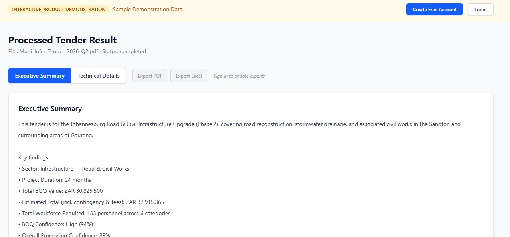
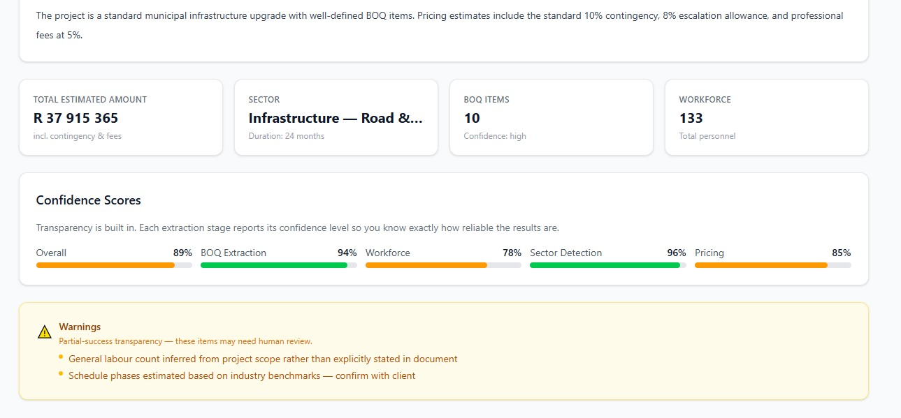
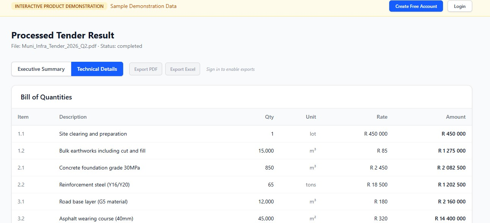
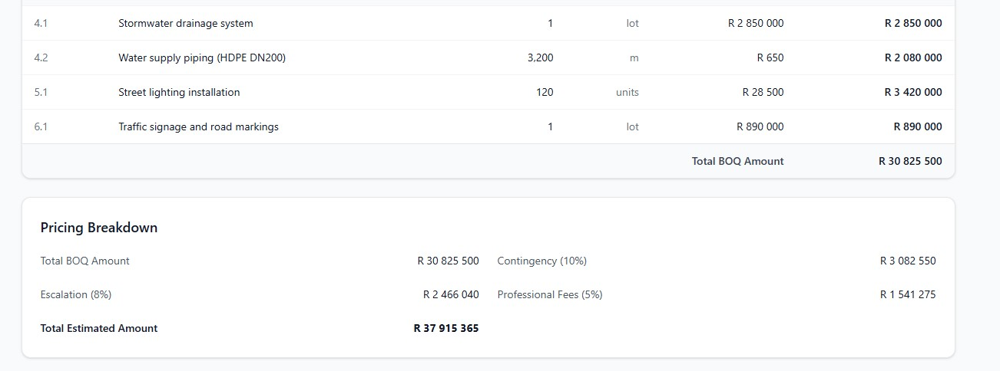
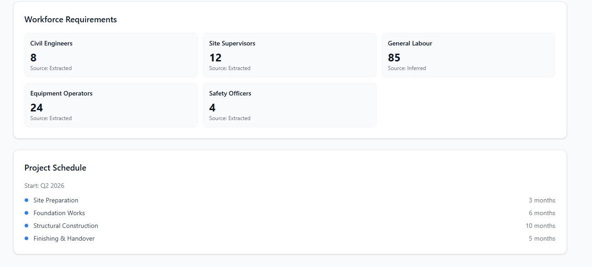

# Tender Engine AI

**Transform tender documents into structured pricing intelligence.**

Tender Engine AI is a production-grade SaaS platform that automatically extracts Bills of Quantities (BOQs), workforce estimates, pricing intelligence, and executive reports from complex tender documents. Built with a transparent honesty architecture — every extraction includes a confidence score, partial successes remain visible, and nothing is hidden behind a black box.

---

## Table of Contents

- [Core Features](#core-features)
- [Honesty Architecture](#honesty-architecture)
- [System Architecture](#system-architecture)
- [Project Structure](#project-structure)
- [Local Development Setup](#local-development-setup)
- [Docker Deployment](#docker-deployment)
- [Environment Variables](#environment-variables)
- [API Overview](#api-overview)
- [Current Status](#current-status)
- [Roadmap](#roadmap)
- [Screenshots](#screenshots)
- [Security & Limitations](#security--limitations)
- [License](#license)
- [Contributing](#contributing)

---

## Core Features

### OCR Fallback for Scanned PDFs
Automatically detects scanned documents and applies OCR (Tesseract) to extract text. Supports hybrid extraction — uses pdfplumber for machine-readable PDFs and falls back to OCR when needed.

### BOQ Extraction
Extracts Bills of Quantities with item numbers, descriptions, quantities, units, rates, and amounts. Outputs structured data ready for analysis, export, or pricing calculation.

### Pricing Intelligence
Generates pricing estimates based on extracted BOQ items, including contingency, escalation, and professional fee calculations. Each pricing result is confidence-scored and presented transparently.

### Workforce Inference
Extracts workforce requirements — categories, counts, and sourcing confidence (extracted vs. inferred) — from tender specifications and schedules.

### Confidence Scoring
Every extraction stage reports its confidence level. No inflated scores. No hidden uncertainty. You know exactly how reliable each data point is.

| Confidence Level | Range  | Meaning                        |
|------------------|--------|--------------------------------|
| High             | ≥ 90%  | Reliable extraction            |
| Medium           | 70–89% | Some uncertainty — review      |
| Low              | < 70%  | May require human verification |

### Honest Partial-Success Architecture
When some stages succeed and others fail, the system preserves and shows the partial success. Failed stages remain visible. Warnings are surfaced. Nothing is discarded silently.

### Retry Failed Stages
Retry only the stages that failed — not the entire document. This means you recover from partial failures efficiently without re-processing what already succeeded.

### Executive PDF Reports
Generate professional PDF reports with executive summaries, key metrics, pricing breakdowns, confidence scores, and warnings. Ready for stakeholder presentation.

### Excel Exports
Export structured BOQ data and pricing to Excel for further analysis, reporting, or integration with procurement systems.

### Persistent Processing History
Full job history with status tracking, result access, and retry support. All results are persisted and retrievable.

### Demo Funnel + Landing Page
Public landing page with product overview, feature showcase, and interactive demo mode that shows a realistic processed tender without requiring login or backend processing.

### JWT Authentication
Secure user registration and login with JWT Bearer tokens. Dual auth support (JWT + legacy API keys) for backward compatibility.

### Dockerized Deployment
Complete Docker setup with multi-stage builds, OCR system dependencies, health checks, and production-ready configuration.

---

## Honesty Architecture

This section is deliberately prominent. It defines the platform's core philosophy.

**The problem with most AI document processing tools:**
- They hallucinate pricing
- They hide failed stages
- They inflate confidence scores
- They present uncertainty as certainty

**The Tender Engine approach:**

> Failed stages and uncertainty remain visible.

Every processing result includes:
- **Completed stages** — shown explicitly
- **Failed stages** — shown explicitly, never hidden
- **Warnings** — surfaced prominently
- **Confidence scores** — per extraction stage, honest and unadjusted
- **Extraction sources** — "extracted" vs. "inferred" clearly labelled

This is not an oversight. It is an architectural decision.

When a pricing estimate is generated from partially complete BOQ data, the result shows `partial_success` status. It does not pretend to have succeeded. The user sees exactly what worked, what didn't, and can retry the failed stages independently.

**You cannot build trust by hiding failures.**

---

## System Architecture

### Backend

| Component       | Technology                         |
|-----------------|------------------------------------|
| Framework       | FastAPI (Python 3.12+)             |
| Database        | SQLite (MVP) → PostgreSQL (planned)|
| Authentication  | JWT Bearer tokens + API key legacy |
| OCR             | Tesseract + pdfplumber + Camelot   |
| PDF Generation  | ReportLab                          |
| Excel Export    | OpenPyXL                           |
| Async Workers   | Background thread pool             |

### Frontend

| Component       | Technology                         |
|-----------------|------------------------------------|
| Framework       | React 19                           |
| Language        | TypeScript                         |
| Styling         | Tailwind CSS 4                     |
| Build           | Vite 8                             |
| Routing         | React Router 7                     |

### Processing Pipeline Stages

```
Upload → Extract Text → Detect Sector → Detect Duration
  → Detect Locations → Extract Workforce → Extract Schedule
  → Extract BOQ → Pricing → Generate Reports
```

Each stage is independent. A failure in one stage does not block the others. The system processes what it can and reports partial success when some stages fail.

---

## Project Structure

```
tender-engine-api/
│
├── api/                          # FastAPI backend
│   ├── main.py                   # Application entry point, middleware, routes
│   ├── routes/                   # API route handlers
│   │   ├── auth.py               # Registration, login, JWT
│   │   ├── process.py            # Upload, processing, results, retry
│   │   ├── leads.py              # Marketing lead capture
│   │   ├── pricing.py            # Pricing endpoints
│   │   ├── boq.py                # BOQ extraction endpoints
│   │   ├── health.py             # Health check
│   │   ├── upload.py             # File upload
│   │   └── ...
│   │
│   ├── schemas/                  # Pydantic request/response models
│   │   ├── auth.py
│   │   ├── process.py
│   │   ├── leads.py
│   │   ├── pricing.py
│   │   └── boq.py
│   │
│   ├── services/                 # Business logic
│   │   ├── pipeline.py           # Main processing pipeline orchestrator
│   │   ├── ocr_extractor.py      # OCR extraction (pdfplumber + Tesseract)
│   │   ├── boq_extractor.py      # BOQ extraction logic
│   │   ├── boq_sanitizer.py      # BOQ cleaning and validation
│   │   ├── pricing_adapter.py    # Pricing calculation engine
│   │   ├── workforce_inference.py # Workforce extraction
│   │   ├── confidence_service.py # Confidence scoring
│   │   ├── summary_builder.py    # Executive summary generation
│   │   ├── pdf_report_service.py # PDF report generation (ReportLab)
│   │   ├── export_service.py     # Excel export (OpenPyXL)
│   │   ├── retry_pipeline.py     # Stage-level retry logic
│   │   ├── auth.py               # JWT token handling
│   │   └── database.py           # SQLite persistence
│   │
│   ├── models/                   # Database models
│   │   ├── tender.py
│   │   ├── tender_result.py
│   │   └── processing_event.py
│   │
│   ├── middleware/               # Custom middleware
│   ├── utils/                    # Utility functions
│   └── storage/                  # File storage configuration
│
├── tender-engine-frontend/       # React + TypeScript frontend
│   ├── src/
│   │   ├── pages/                # Route pages
│   │   │   ├── LandingPage.tsx   # Public landing page
│   │   │   ├── DemoPage.tsx      # Interactive demo
│   │   │   ├── Dashboard.tsx     # Authenticated dashboard
│   │   │   ├── Login.tsx
│   │   │   └── Register.tsx
│   │   │
│   │   ├── components/           # Reusable components
│   │   │   ├── landing/          # Landing page sections
│   │   │   ├── ResultViewer.tsx  # Processing result display
│   │   │   ├── UploadCard.tsx
│   │   │   └── TenderHistory.tsx
│   │   │
│   │   ├── services/             # API client, auth, polling
│   │   ├── context/              # React context (auth)
│   │   ├── hooks/                # Custom hooks
│   │   ├── types/                # TypeScript interfaces
│   │   └── demo/                 # Demo data for interactive mode
│   │
│   ├── Dockerfile                # Multi-stage frontend build
│   └── nginx.conf                # Nginx serving config
│
├── storage/                      # Uploaded files and outputs
│   ├── outputs/                  # Generated reports, exports
│   └── test_tenders/             # Sample documents
│
├── tests/                        # Backend test suite
│   ├── test_auth.py
│   ├── test_pipeline.py
│   ├── test_pricing.py
│   ├── test_boq_extractor.py
│   ├── test_hardening.py
│   ├── test_upload_security.py
│   ├── test_processing_results.py
│   └── test_result_endpoint_flow.py
│
├── Dockerfile                    # Backend Docker image
├── requirements.txt
└── README.md
```

---

## Local Development Setup

### Prerequisites

- Python 3.12+
- Node.js 20+
- Tesseract OCR (for scanned document processing)

### Backend Setup

```bash
# 1. Clone the repository
git clone https://github.com/alljaybly/tender-engine-api.git
cd tender-engine-api

# 2. Create and activate virtual environment
python -m venv venv

# Ubuntu / WSL
source venv/bin/activate

# Windows
venv\Scripts\activate

# 3. Install Python dependencies
pip install -r requirements.txt

# 4. Install OCR system dependencies (Ubuntu / WSL)
sudo apt install tesseract-ocr poppler-utils ghostscript

# 5. Set environment variables
export SECRET_KEY="your-secret-key-change-in-production"
export JWT_ALGORITHM="HS256"
export JWT_EXPIRE_MINUTES="1440"

# 6. Start the FastAPI development server
uvicorn api.main:app --reload --port 8000
```

The API will be available at `http://localhost:8000` with Swagger docs at `http://localhost:8000/docs`.

### Frontend Setup

```bash
# 1. Navigate to frontend directory
cd tender-engine-frontend

# 2. Install dependencies
npm install

# 3. Set environment (optional)
# Create .env file with:
VITE_API_BASE_URL=http://localhost:8000

# 4. Start the development server
npm run dev
```

The frontend will be available at `http://localhost:5173`.

### Environment Variables (.env)

Create a `.env` file in the project root:

```env
SECRET_KEY=your-secret-key-here
JWT_ALGORITHM=HS256
JWT_EXPIRE_MINUTES=1440
CORS_ORIGINS=http://localhost:5173,http://127.0.0.1:5173
```

---

## Docker Deployment

### Backend

```bash
# Build the backend image
docker build -t tender-engine-api .

# Run the container
docker run -d \
  --name tender-engine-api \
  -p 8000:8000 \
  -e SECRET_KEY="your-secret-key" \
  -e JWT_ALGORITHM="HS256" \
  -e JWT_EXPIRE_MINUTES="1440" \
  -v tender-engine-data:/app/data \
  tender-engine-api
```

The Docker image includes:
- Tesseract OCR with English language pack
- Poppler utilities (pdf2image)
- Ghostscript
- Multi-stage build for minimal image size
- Health check endpoint

### Frontend

```bash
# Build the frontend image
cd tender-engine-frontend
docker build -t tender-engine-frontend .

# Run the container
docker run -d \
  --name tender-engine-frontend \
  -p 5173:80 \
  tender-engine-frontend
```

The frontend Docker image uses Nginx with:
- Multi-stage build (Node build → Nginx serve)
- Optimized static asset serving
- API proxy configuration

### Docker Compose (recommended)

A `docker-compose.yml` setup would define three services:
1. `api` — FastAPI backend on port 8000
2. `frontend` — Nginx-served React app on port 80
3. `data` — Persistent volume for SQLite database and uploads

---

## Environment Variables

| Variable            | Default                        | Description                        |
|---------------------|--------------------------------|------------------------------------|
| `SECRET_KEY`        | (required)                     | JWT signing secret                 |
| `JWT_ALGORITHM`     | `HS256`                        | JWT signing algorithm              |
| `JWT_EXPIRE_MINUTES`| `1440`                         | JWT token lifetime (minutes)       |
| `CORS_ORIGINS`      | `http://localhost:5173`        | Allowed CORS origins (comma-sep)   |
| `MAX_UPLOAD_SIZE`   | `52428800`                     | Max upload size in bytes (50 MB)   |

Frontend:

| Variable              | Default                        | Description                |
|-----------------------|--------------------------------|----------------------------|
| `VITE_API_BASE_URL`   | `http://localhost:8000`        | Backend API base URL       |

---

## API Overview

### Authentication

| Method | Endpoint             | Description        |
|--------|----------------------|--------------------|
| POST   | `/api/auth/register` | Create account     |
| POST   | `/api/auth/login`    | Get JWT token      |

### Processing

| Method | Endpoint                          | Description              |
|--------|-----------------------------------|--------------------------|
| POST   | `/api/process/upload`             | Upload tender document   |
| GET    | `/api/process/status/{job_id}`    | Check processing status  |
| GET    | `/api/process/result/{job_id}`    | Get processing result    |
| POST   | `/api/process/retry/{job_id}`     | Retry failed stages      |
| GET    | `/api/process/history`            | List processing history  |

### Pricing & BOQ

| Method | Endpoint                          | Description              |
|--------|-----------------------------------|--------------------------|
| GET    | `/api/pricing/{tender_id}`        | Get pricing estimate     |
| GET    | `/api/boq/{tender_id}`            | Get BOQ extraction       |

### Lead Capture

| Method | Endpoint             | Description           |
|--------|----------------------|-----------------------|
| POST   | `/api/leads`         | Capture marketing lead|

### System

| Method | Endpoint             | Description        |
|--------|----------------------|--------------------|
| GET    | `/health`            | Health check       |

---

## Current Status

**Phase: Pilot-Ready MVP**

### Working
- ✅ Tender document upload (PDF, DOCX, TXT)
- ✅ OCR extraction for scanned documents
- ✅ Text extraction for machine-readable documents
- ✅ BOQ extraction with confidence scoring
- ✅ Pricing intelligence with markup calculations
- ✅ Workforce extraction (extracted + inferred)
- ✅ Schedule extraction
- ✅ Executive PDF report generation
- ✅ Excel export
- ✅ Stage-level retry for failed processing
- ✅ Partial-success transparency
- ✅ JWT authentication and user management
- ✅ Processing history with persistent results
- ✅ Public landing page
- ✅ Interactive demo mode (no login required)
- ✅ Lead capture system
- ✅ Dockerized deployment
- ✅ Comprehensive test suite

### Still Evolving
- 🔄 Historical tender intelligence and comparison
- 🔄 Subscription plans and billing
- 🔄 Analytics dashboard
- 🔄 Admin system
- 🔄 User organization management
- 🔄 PostgreSQL production database

---

## Roadmap

### Short Term (Next 3 Months)
- **Production deployment** — Cloud hosting, domain, SSL
- **PayFast integration** — South African payment gateway
- **Stripe support** — International payment processing
- **Subscription management** — Plan tiers, usage tracking

### Medium Term (3–6 Months)
- **Historical tender intelligence** — Compare pricing across tenders
- **Analytics dashboard** — Usage metrics, extraction quality trends
- **Procurement insights** — Identify patterns in tender data
- **Multi-user organizations** — Team accounts with role-based access

### Long Term (6–12 Months)
- **Admin system** — User management, system monitoring
- **PostgreSQL migration** — Production-grade database
- **API rate limiting** — Tiered API access for integrations
- **Webhook notifications** — Event-driven integrations

---

## Screenshots

### Landing Page
```
Screenshot coming soon
```

### Dashboard
```
Screenshot coming soon
```

### Processing Results
```
Screenshot coming soon
```

### Pricing Breakdown
```
Screenshot coming soon
```

### PDF Export
```
Screenshot coming soon
```

### Interactive Demo
```
Screenshot coming soon
```

---

## Security & Limitations

### Security
- JWT Bearer token authentication
- Password hashing with bcrypt
- File upload type and size validation
- File hash deduplication
- SQL injection prevention via parameterized queries
- CORS origin restriction
- Rate limiting infrastructure (expansion planned)

### Known Limitations
- **OCR quality** — Scanned PDF quality directly impacts extraction accuracy. Low-resolution scans, handwritten text, and poor contrast may produce unreliable results. The confidence scoring system makes this uncertainty visible.
- **Pricing is estimated** — Pricing intelligence generates estimates based on extracted BOQ items and configurable markup rates. It is not a quote or binding price. All pricing results are clearly labelled as estimates.
- **SQLite (MVP)** — The current database uses SQLite, which is suitable for single-server deployments and development. Production deployments will require PostgreSQL for concurrent multi-user access.
- **Single-user focus** — The current architecture is optimized for individual users and small teams. Multi-organization support is on the roadmap.

---

## License

This project is currently under active development.

MIT License — see [LICENSE](LICENSE) file for details (if present).

For commercial licensing inquiries, contact the repository owner.

---

## Contributing

Contributions are welcome. Please follow these guidelines:

1. **Open an issue** before starting significant work to discuss the approach
2. **Write tests** for new functionality
3. **Maintain the honesty architecture** — no hidden failures, no inflated scores
4. **Follow existing code patterns** — TypeScript strict mode, Python type hints
5. **Update documentation** — README, API docs, and inline comments

### Development Setup

```bash
# Backend
python -m venv venv
source venv/bin/activate
pip install -r requirements.txt
pip install -r requirements.lock.txt

# Run tests
pytest tests/ -v

# Frontend
cd tender-engine-frontend
npm install
npm run build
```

---

## Contact

**Project Owner:** Allen Blythe

**Repository:** [https://github.com/alljaybly/tender-engine-api](https://github.com/alljaybly/tender-engine-api)

---

*Tender Engine AI — Transform tender documents into structured pricing intelligence.*

# Tender Engine API
=======
# Tender Engine AI
>>>>>>> 1c4a1e8 (Phase 5B complete - landing page, demo funnel, OCR, exports, confidence scoring, Docker deployment)


**Transform tender documents into structured pricing intelligence.**

Tender Engine AI is a production-grade SaaS platform that automatically extracts Bills of Quantities (BOQs), workforce estimates, pricing intelligence, and executive reports from complex tender documents. Built with a transparent honesty architecture — every extraction includes a confidence score, partial successes remain visible, and nothing is hidden behind a black box.

---

## Overview

Tender Engine AI processes tender documents end-to-end: upload a PDF, DOCX, or TXT file; the system extracts text, identifies sector, duration, location, workforce requirements, schedules, and BOQ line items; generates pricing estimates with confidence scoring; and produces executive PDF reports and Excel exports — all while maintaining full transparency about what succeeded, what failed, and how reliable each result is.

The platform includes a public landing page, interactive demo mode, JWT authentication, persistent processing history, stage-level retry for failed steps, and Dockerized deployment with OCR system dependencies pre-configured.

---

## Key Features

- **OCR Fallback for Scanned PDFs** — Automatically detects scanned documents and applies Tesseract OCR. Hybrid extraction uses pdfplumber for machine-readable PDFs and falls back to OCR when needed.
- **BOQ Extraction** — Extracts Bills of Quantities with item numbers, descriptions, quantities, units, rates, and amounts. Outputs structured data ready for analysis, export, or pricing calculation.
- **Pricing Intelligence** — Generates pricing estimates based on extracted BOQ items, including contingency, escalation, and professional fee calculations. Each pricing result is confidence-scored and presented transparently.
- **Workforce Inference** — Extracts workforce requirements — categories, counts, and sourcing confidence (extracted vs. inferred) — from tender specifications and schedules.
- **Confidence Scoring** — Every extraction stage reports its confidence level. No inflated scores. No hidden uncertainty.
- **Partial-Success Transparency** — When some stages succeed and others fail, the system preserves and shows the partial success. Failed stages remain visible. Nothing is discarded silently.
- **Stage-Level Retry** — Retry only the stages that failed — not the entire document. Recover from partial failures efficiently.
- **Executive PDF Reports** — Professional PDF reports with executive summaries, key metrics, pricing breakdowns, confidence scores, and warnings.
- **Excel Exports** — Export structured BOQ data and pricing to Excel for further analysis.
- **Persistent Processing History** — Full job history with status tracking, result access, and retry support.
- **Demo Funnel + Landing Page** — Public landing page with product overview, feature showcase, and interactive demo mode.
- **JWT Authentication** — Secure user registration and login with JWT Bearer tokens.
- **Dockerized Deployment** — Complete Docker setup with multi-stage builds, OCR system dependencies, health checks, and production-ready configuration.

---

## Screenshots

### Executive Dashboard


Main tender analysis dashboard showing document processing status, quick statistics, and navigation to all platform features.

### Processing Dashboard


Real-time processing dashboard displaying document queues, active jobs, and processing history with status indicators for each tender.

### Processing Result 1 — Overview


Detailed processing result view showing extracted sections, confidence scores per stage, and warnings for any partial failures.

### Processing Result 2 — BOQ View


Structured BOQ extraction results with item numbers, descriptions, quantities, units, rates, and amounts — ready for pricing calculation.

### Processing Result 3 — Full Report


Comprehensive result view combining extracted data, confidence indicators, retry controls for failed stages, and export options.

### Detailed BOQ & Pricing


Side-by-side view of extracted BOQ items and the calculated pricing estimate with contingency, escalation, and professional fees.

### Pricing Breakdown 1


Detailed pricing breakdown showing line-item costs, markup calculations, subtotals, and the final estimated tender price.

### Pricing Breakdown 2


Extended pricing view with cost category breakdowns, contingency allocation, escalation projections, and professional fee calculations.

### PDF Export


Generated executive PDF report with cover page, key metrics, pricing summary, confidence scores, and warnings — ready for stakeholder presentation.

### PDF Export — Before Processing


The document pre-processing view showing the original tender file before extraction begins.

### Start Processing Tenders Smarter


Landing page hero section communicating the core value proposition: transforming complex tender documents into structured pricing intelligence.

### How It Works


Three-step explainer section showing the platform workflow: Upload → Extract → Export. Clear visual funnel from document upload to final deliverable.

### Everything You Need to Process Tenders


Feature grid showcasing the complete toolset: BOQ extraction, pricing engine, workforce inference, PDF reports, Excel exports, and confidence scoring.

### Transparency Is Built In


Honesty architecture visual — showing how partial success, visible warnings, and confidence scoring create trust through transparency.

### Sign In


Secure authentication page with JWT-based login and registration for accessing the full tender processing platform.

### Request Access


Early access lead capture form for collecting interest, company details, and use-case information before full production launch.

### Demo 1 — Interactive Demo View



Interactive demo showing a realistic processed tender result — no login or backend required. Demonstrates the full output experience.

### Demo 2 — Demo Pricing



Demo mode pricing breakdown showing how the system presents line-item costs, confidence scores, and partial-success indicators.

### Demo 3 — Demo BOQ



Demo mode BOQ extraction view with itemized quantities, units, rates, and structural data presentation.

### Demo 4 — Demo Reports



Demo mode export preview showing PDF report generation and Excel download options.

### Demo 5 — Demo Dashboard



Demo mode history and dashboard view giving prospects a feel for the full platform experience without authentication.

---

## Demo Funnel

Tender Engine AI includes a complete demo funnel designed to convert landing page visitors into registered users:

1. **Landing Page** — Product overview, feature showcase, and transparency messaging.
2. **Interactive Demo** — A one-click demo that loads a realistic processed tender result. No login, no backend call, no commitment. Prospects see exactly what a real extraction looks like.
3. **Lead Capture** — Integrated lead capture form on the landing page collects early access interest.
4. **Authentication** — JWT-based sign-up and login gates the full platform.

The demo system uses pre-bundled realistic data that mirrors actual processing output — including BOQ items, pricing breakdowns, workforce estimates, confidence scores, and even simulated partial failures to demonstrate the honesty architecture in action.

---

## OCR + AI Extraction Pipeline

```
Upload → Extract Text → Detect Sector → Detect Duration
  → Detect Locations → Extract Workforce → Extract Schedule
  → Extract BOQ → Pricing → Generate Reports
```

Each stage is independent. A failure in one stage does not block the others. The system processes what it can and reports partial success when some stages fail.

**Extraction stages:**

| Stage | Technology | Output |
|-------|-----------|--------|
| Text Extraction | pdfplumber / Tesseract OCR | Raw text with extraction method labelled |
| Sector Detection | Regex + keyword matching | Construction sector classification |
| Duration Detection | Date pattern extraction | Project duration in months |
| Location Detection | Geographic entity extraction | Country, province, city, site |
| Workforce Inference | Pattern matching + inference logic | Categories, counts, sourcing confidence |
| Schedule Extraction | Date range parsing | Milestone timeline with confidence |
| BOQ Extraction | Section-based line item parsing | Structured items with confidence |
| Pricing Engine | Markup calculation engine | Estimated pricing with breakdowns |
| Report Generation | ReportLab / OpenPyXL | PDF + Excel exports |

---

## Pricing Engine

The pricing engine calculates estimated tender prices from extracted BOQ data:

- **Base Cost** — Sum of all BOQ line-item amounts
- **Contingency** — Configurable percentage of base cost
- **Escalation** — Time-based cost escalation projection
- **Professional Fees** — Percentage-based fee calculation
- **Total Estimated Price** — Sum of all components

Each pricing result is clearly labelled as an estimate. The engine never fabricates data — if BOQ extraction is incomplete, the pricing result shows `partial_success` status with an honest assessment of reliability.

| Pricing Component | Default Rate | Confidence Impact |
|-------------------|-------------|-------------------|
| Contingency | 10% | Reduced if BOQ incomplete |
| Escalation | 8% / year | Reduced if duration uncertain |
| Professional Fees | 12% | Tracks base cost confidence |

---

## Retry Architecture

The retry system is designed for efficiency and transparency:

- **Stage-Level Granularity** — Retry only failed stages, not the entire document.
- **Preserved Successes** — Previously successful stages are cached and not reprocessed.
- **Idempotent Design** — Each extraction stage is independently callable.
- **Status Transparency** — The result always shows `stages_completed`, `stages_failed`, and `overall_status` (success / partial_success / failed).

> If BOQ extraction succeeds but workforce inference fails, retrying the job only re-runs workforce inference. The BOQ data is preserved. The result status reflects the new outcome honestly.

---

## Confidence Scoring

Every extraction stage reports its confidence level. No inflated scores. No hidden uncertainty.

| Confidence Level | Range | Meaning |
|------------------|-------|---------|
| High | ≥ 90% | Reliable extraction — ready for use |
| Medium | 70–89% | Some uncertainty — review recommended |
| Low | < 70% | May require human verification |

**Confidence factors:**
- Text extraction quality (machine-read vs. OCR)
- Pattern match strength
- Data completeness
- Cross-validation with other extraction stages

Confidence scores are never adjusted upward. If the system is uncertain, it reports that uncertainty.

---

## Excel & PDF Export

### PDF Reports (ReportLab)

Professional executive reports including:
- Cover page with tender title and date
- Executive summary with key metrics
- Pricing breakdown with contingency and escalation
- Workforce summary
- Confidence scores per extraction stage
- Warnings and partial-success indicators
- Ready for stakeholder presentation

### Excel Export (OpenPyXL)

Structured data export including:
- BOQ line items with quantities, units, rates, amounts
- Pricing breakdown with all components
- Workforce summary with categories and counts
- Metadata and confidence annotations

---

## Landing Page

The public landing page (`/`) serves as the primary marketing and conversion surface:

- **Hero Section** — Value proposition and CTA to try the demo
- **Feature Grid** — Key capabilities with icons and descriptions
- **How It Works** — Three-step visual funnel (Upload → Extract → Export)
- **Screenshots** — Product teaser images with captions
- **Transparency Section** — Honesty architecture messaging
- **Lead Capture Form** — Early access sign-up with company and use-case fields
- **CTA Section** — Final conversion prompt

All landing page content is configurable and does not require backend connectivity.

---

## Technology Stack

### Backend

| Component | Technology |
|-----------|-----------|
| Framework | FastAPI (Python 3.12+) |
| Database | SQLite (MVP) → PostgreSQL (planned) |
| Authentication | JWT Bearer tokens + API key legacy |
| OCR | Tesseract + pdfplumber + Camelot |
| PDF Generation | ReportLab |
| Excel Export | OpenPyXL |
| Async Workers | Background thread pool |

### Frontend

| Component | Technology |
|-----------|-----------|
| Framework | React 19 |
| Language | TypeScript (strict mode) |
| Styling | Tailwind CSS 4 |
| Build | Vite 8 |
| Routing | React Router 7 |

### Infrastructure

| Component | Technology |
|-----------|-----------|
| Containerization | Docker (multi-stage builds) |
| Frontend Serving | Nginx |
| Health Checks | FastAPI `/health` endpoint |

---

## Local Development

### Prerequisites

- Python 3.12+
- Node.js 20+
- Tesseract OCR (for scanned document processing)

### Backend Setup

```bash
# 1. Clone the repository
git clone https://github.com/alljaybly/tender-engine-api.git
cd tender-engine-api

# 2. Create and activate virtual environment
python -m venv venv

# Ubuntu / WSL
source venv/bin/activate

# Windows
venv\Scripts\activate

# 3. Install Python dependencies
pip install -r requirements.txt

# 4. Install OCR system dependencies (Ubuntu / WSL)
sudo apt install tesseract-ocr poppler-utils ghostscript

# 5. Set environment variables
export SECRET_KEY="your-secret-key-change-in-production"
export JWT_ALGORITHM="HS256"
export JWT_EXPIRE_MINUTES="1440"

# 6. Start the FastAPI development server
uvicorn api.main:app --reload --port 8000
```

The API will be available at `http://localhost:8000` with Swagger docs at `http://localhost:8000/docs`.

### Frontend Setup

```bash
# 1. Navigate to frontend directory
cd tender-engine-frontend

# 2. Install dependencies
npm install

# 3. Set environment (optional)
# Create .env file with:
VITE_API_BASE_URL=http://localhost:8000

# 4. Start the development server
npm run dev
```

The frontend will be available at `http://localhost:5173`.

---

## Docker Deployment

### Backend

```bash
# Build the backend image
docker build -t tender-engine-api .

# Run the container
docker run -d \
  --name tender-engine-api \
  -p 8000:8000 \
  -e SECRET_KEY="your-secret-key" \
  -e JWT_ALGORITHM="HS256" \
  -e JWT_EXPIRE_MINUTES="1440" \
  -v tender-engine-data:/app/data \
  tender-engine-api
```

The Docker image includes:
- Tesseract OCR with English language pack
- Poppler utilities (pdf2image)
- Ghostscript
- Multi-stage build for minimal image size
- Health check endpoint

### Frontend

```bash
# Build the frontend image
cd tender-engine-frontend
docker build -t tender-engine-frontend .

# Run the container
docker run -d \
  --name tender-engine-frontend \
  -p 5173:80 \
  tender-engine-frontend
```

The frontend Docker image uses Nginx with:
- Multi-stage build (Node build → Nginx serve)
- Optimized static asset serving
- API proxy configuration

### Docker Compose (recommended)

A `docker-compose.yml` setup defines three services:
1. **api** — FastAPI backend on port 8000
2. **frontend** — Nginx-served React app on port 80
3. **data** — Persistent volume for SQLite database and uploads

---

## Environment Variables

| Variable | Default | Description |
|----------|---------|-------------|
| `SECRET_KEY` | (required) | JWT signing secret |
| `JWT_ALGORITHM` | `HS256` | JWT signing algorithm |
| `JWT_EXPIRE_MINUTES` | `1440` | JWT token lifetime (minutes) |
| `CORS_ORIGINS` | `http://localhost:5173` | Allowed CORS origins (comma-separated) |
| `MAX_UPLOAD_SIZE` | `52428800` | Max upload size in bytes (50 MB) |

### Frontend

| Variable | Default | Description |
|----------|---------|-------------|
| `VITE_API_BASE_URL` | `http://localhost:8000` | Backend API base URL |

---

## API Endpoints

### Authentication

| Method | Endpoint | Description |
|--------|----------|-------------|
| POST | `/api/auth/register` | Create account |
| POST | `/api/auth/login` | Get JWT token |

### Processing

| Method | Endpoint | Description |
|--------|----------|-------------|
| POST | `/api/process/upload` | Upload tender document |
| GET | `/api/process/status/{job_id}` | Check processing status |
| GET | `/api/process/result/{job_id}` | Get processing result |
| POST | `/api/process/retry/{job_id}` | Retry failed stages |
| GET | `/api/process/history` | List processing history |

### Pricing & BOQ

| Method | Endpoint | Description |
|--------|----------|-------------|
| GET | `/api/pricing/{tender_id}` | Get pricing estimate |
| GET | `/api/boq/{tender_id}` | Get BOQ extraction |

### Lead Capture

| Method | Endpoint | Description |
|--------|----------|-------------|
| POST | `/api/leads` | Capture marketing lead |

### System

| Method | Endpoint | Description |
|--------|----------|-------------|
| GET | `/health` | Health check |

---

## Project Structure

```
tender-engine-api/
│
├── api/                          # FastAPI backend
│   ├── main.py                   # Application entry point, middleware, routes
│   ├── routes/                   # API route handlers
│   │   ├── auth.py               # Registration, login, JWT
│   │   ├── process.py            # Upload, processing, results, retry
│   │   ├── leads.py              # Marketing lead capture
│   │   ├── pricing.py            # Pricing endpoints
│   │   ├── boq.py                # BOQ extraction endpoints
│   │   ├── health.py             # Health check
│   │   └── upload.py             # File upload
│   │
│   ├── schemas/                  # Pydantic request/response models
│   │   ├── auth.py
│   │   ├── process.py
│   │   ├── leads.py
│   │   ├── pricing.py
│   │   └── boq.py
│   │
│   ├── services/                 # Business logic
│   │   ├── pipeline.py           # Main processing pipeline orchestrator
│   │   ├── ocr_extractor.py      # OCR extraction (pdfplumber + Tesseract)
│   │   ├── boq_extractor.py      # BOQ extraction logic
│   │   ├── boq_sanitizer.py      # BOQ cleaning and validation
│   │   ├── pricing_adapter.py    # Pricing calculation engine
│   │   ├── workforce_inference.py # Workforce extraction
│   │   ├── confidence_service.py # Confidence scoring
│   │   ├── summary_builder.py    # Executive summary generation
│   │   ├── pdf_report_service.py # PDF report generation (ReportLab)
│   │   ├── export_service.py     # Excel export (OpenPyXL)
│   │   ├── retry_pipeline.py     # Stage-level retry logic
│   │   ├── auth.py               # JWT token handling
│   │   └── database.py           # SQLite persistence
│   │
│   ├── models/                   # Database models
│   │   ├── tender.py
│   │   ├── tender_result.py
│   │   └── processing_event.py
│   │
│   ├── middleware/               # Custom middleware
│   ├── utils/                    # Utility functions
│   └── storage/                  # File storage configuration
│
├── tender-engine-frontend/       # React + TypeScript frontend
│   ├── src/
│   │   ├── pages/                # Route pages
│   │   │   ├── LandingPage.tsx   # Public landing page
│   │   │   ├── DemoPage.tsx      # Interactive demo
│   │   │   ├── Dashboard.tsx     # Authenticated dashboard
│   │   │   ├── Login.tsx
│   │   │   └── Register.tsx
│   │   │
│   │   ├── components/           # Reusable components
│   │   │   ├── landing/          # Landing page sections
│   │   │   ├── ResultViewer.tsx  # Processing result display
│   │   │   ├── UploadCard.tsx
│   │   │   └── TenderHistory.tsx
│   │   │
│   │   ├── services/             # API client, auth, polling
│   │   ├── context/              # React context (auth)
│   │   ├── hooks/                # Custom hooks
│   │   ├── types/                # TypeScript interfaces
│   │   └── demo/                 # Demo data for interactive mode
│   │
│   ├── Dockerfile                # Multi-stage frontend build
│   └── nginx.conf                # Nginx serving config
│
├── storage/                      # Uploaded files and outputs
│   ├── outputs/                  # Generated reports, exports
│   └── test_tenders/             # Sample documents
│
├── tests/                        # Backend test suite
│   ├── test_auth.py
│   ├── test_pipeline.py
│   ├── test_pricing.py
│   ├── test_boq_extractor.py
│   ├── test_hardening.py
│   ├── test_upload_security.py
│   ├── test_processing_results.py
│   └── test_result_endpoint_flow.py
│
├── screenshots/                  # Product screenshots for README and landing page
│
├── Dockerfile                    # Backend Docker image
├── requirements.txt
└── README.md
```

---

## Security & Honesty Architecture

### Security

- JWT Bearer token authentication
- Password hashing with bcrypt
- File upload type and size validation
- File hash deduplication
- SQL injection prevention via parameterized queries
- CORS origin restriction
- Rate limiting infrastructure (expansion planned)

### Honesty Architecture

This is the platform's core philosophy — deliberately prominent and non-negotiable.

**The problem with most AI document processing tools:**
- They hallucinate pricing
- They hide failed stages
- They inflate confidence scores
- They present uncertainty as certainty

**The Tender Engine approach:**

> Failed stages and uncertainty remain visible. Always.

Every processing result includes:
- **Completed stages** — shown explicitly
- **Failed stages** — shown explicitly, never hidden
- **Warnings** — surfaced prominently
- **Confidence scores** — per extraction stage, honest and unadjusted
- **Extraction sources** — "extracted" vs. "inferred" clearly labelled

This is not an oversight. It is an architectural decision.

When a pricing estimate is generated from partially complete BOQ data, the result shows `partial_success` status. It does not pretend to have succeeded. The user sees exactly what worked, what didn't, and can retry the failed stages independently.

**You cannot build trust by hiding failures.**

**No fabricated pricing. No inflated scores. No hidden failures.**

---

## Limitations

- **OCR quality** — Scanned PDF quality directly impacts extraction accuracy. Low-resolution scans, handwritten text, and poor contrast may produce unreliable results. The confidence scoring system makes this uncertainty visible.
- **Pricing is estimated** — Pricing intelligence generates estimates based on extracted BOQ items and configurable markup rates. It is not a quote or binding price. All pricing results are clearly labelled as estimates.
- **SQLite (MVP)** — The current database uses SQLite, suitable for single-server deployments and development. Production deployments will require PostgreSQL for concurrent multi-user access.
- **Single-user focus** — The current architecture is optimized for individual users and small teams. Multi-organization support is on the roadmap.

---

## Current Status

Tender Engine AI is currently in active production preparation.

### Implemented
- ✅ Tender document upload (PDF, DOCX, TXT)
- ✅ OCR fallback for scanned tenders
- ✅ Text extraction for machine-readable documents
- ✅ BOQ extraction with confidence scoring
- ✅ Pricing engine with markup calculations
- ✅ Workforce inference (extracted + inferred)
- ✅ Schedule extraction
- ✅ Retry architecture (stage-level granularity)
- ✅ Confidence scoring per extraction stage
- ✅ Partial-success transparency
- ✅ Executive PDF report generation
- ✅ Excel export
- ✅ JWT authentication and user management
- ✅ Persistent processing history
- ✅ Public landing page with lead capture
- ✅ Interactive demo mode (no login required)
- ✅ Dockerized deployment
- ✅ Comprehensive test suite

### In Progress
- 🔄 Historical tender intelligence and comparison
- 🔄 Advanced analytics and usage metrics
- 🔄 Team collaboration and organization management
- 🔄 Subscription plans and billing (PayFast / Stripe)
- 🔄 Admin system and user management
- 🔄 PostgreSQL production database migration

---

## Roadmap

### Short Term (Next 3 Months)
- **Production deployment** — Cloud hosting, domain, SSL
- **PayFast integration** — South African payment gateway
- **Stripe support** — International payment processing
- **Subscription management** — Plan tiers, usage tracking

### Medium Term (3–6 Months)
- **Historical tender intelligence** — Compare pricing across tenders
- **Analytics dashboard** — Usage metrics, extraction quality trends
- **Procurement insights** — Identify patterns in tender data
- **Multi-user organizations** — Team accounts with role-based access

### Long Term (6–12 Months)
- **Admin system** — User management, system monitoring
- **PostgreSQL migration** — Production-grade database
- **API rate limiting** — Tiered API access for integrations
- **Webhook notifications** — Event-driven integrations

---

## License

This project is currently under active development.

MIT License — see [LICENSE](LICENSE) file for details (if present).

For commercial licensing inquiries, contact the repository owner.

---

## Contact / Early Access

Tender Engine AI is preparing for production launch.

For demos, partnerships, or early access inquiries:
- Create an issue on [GitHub](https://github.com/alljaybly/tender-engine-api/issues)
- Use the landing page lead capture form
- Reach out to the project owner via the repository

**Project Owner:** Allen Blythe

**Repository:** [https://github.com/alljaybly/tender-engine-api](https://github.com/alljaybly/tender-engine-api)

---

## Disclaimer

Tender Engine AI provides estimated pricing intelligence for informational and planning purposes only. All pricing outputs are clearly labelled as estimates and should not be considered as binding quotations. Users should verify extraction results and pricing calculations before making procurement or bidding decisions. The platform's confidence scoring system is designed to surface uncertainty transparently — users are encouraged to review low-confidence results carefully.

---

*Tender Engine AI — Transform tender documents into structured pricing intelligence.*